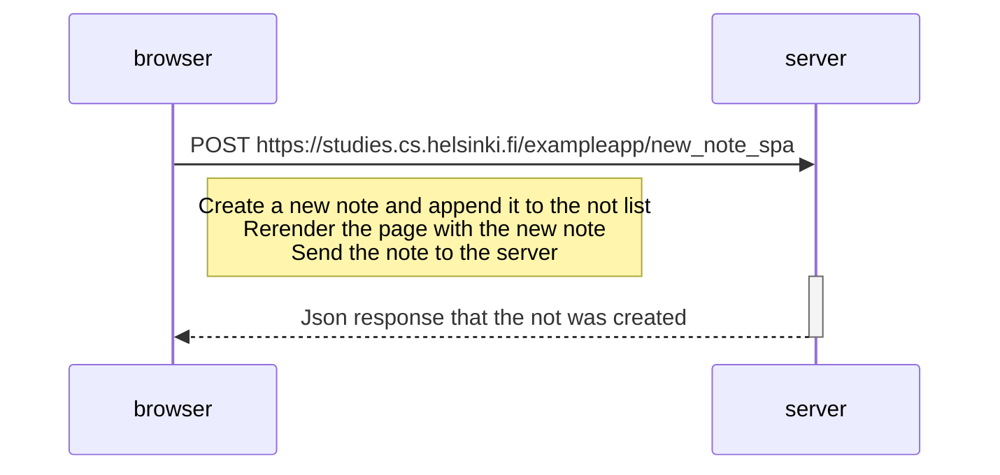

```mermaid
	sequenceDiagram
		participant browser
		participant server

		browser->>server: POST https://studies.cs.helsinki.fi/exampleapp/new_note_spa
		Note right of browser: Create a new note and append it to the not list<br>Rerender the page with the new note<br>Send the note to the server
		
		activate server
		server-->>browser: Json response that the not was created
		deactivate server
```
